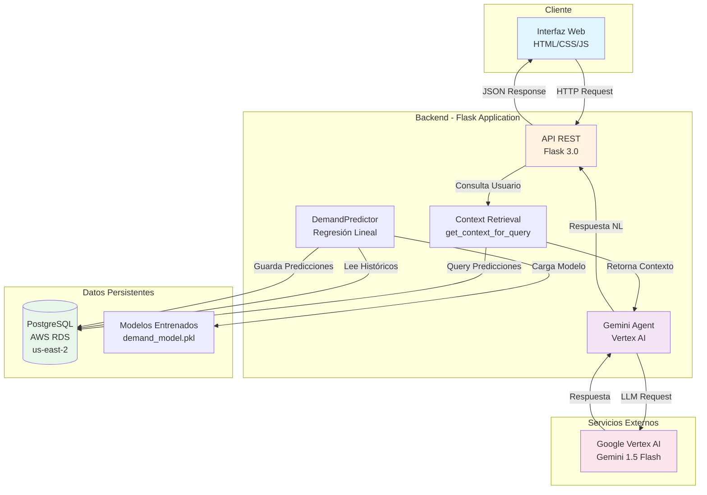
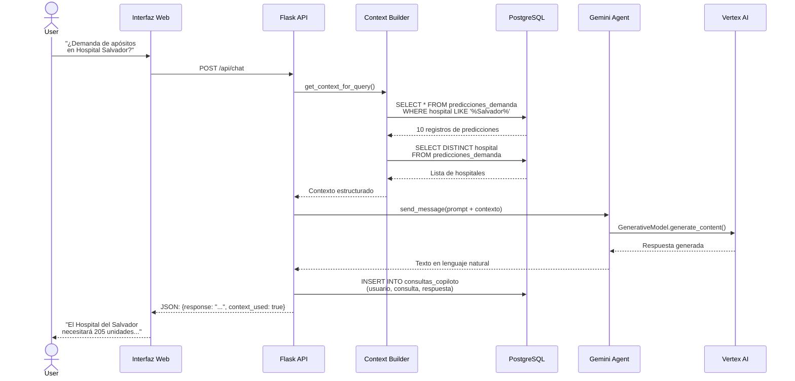
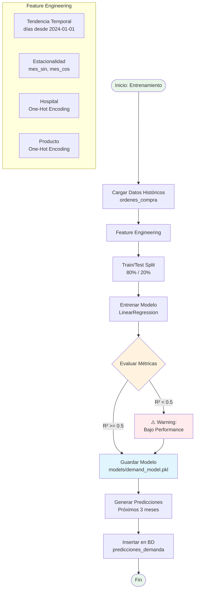
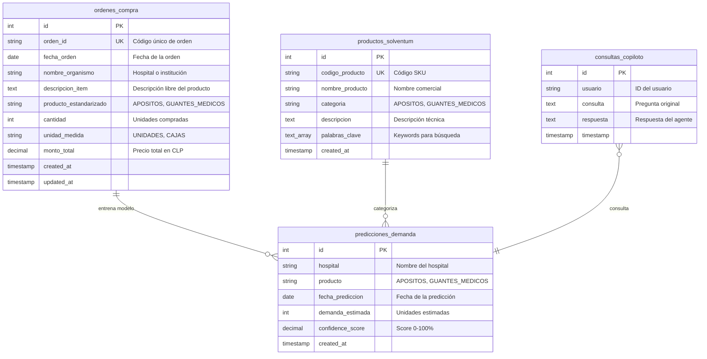
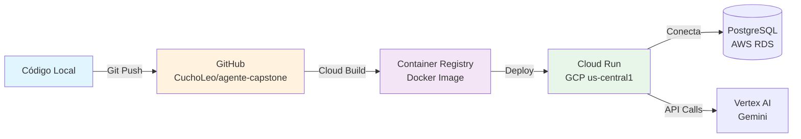

# Arquitectura del Sistema - Agente Capstone

## Visión General

Sistema de inteligencia artificial que predice la demanda hospitalaria de insumos médicos en Chile, combinando un modelo predictivo de Machine Learning con un asistente conversacional basado en Gemini.

---

## Diagrama de Arquitectura General



---

## Flujo de Datos: Consulta del Usuario



---

## Pipeline del Modelo Predictivo



---

## Diagrama de Entidad-Relación (ERD)



---

## Componentes del Sistema

### 1. Interfaz Web (Frontend)

**Tecnología:** HTML5, CSS3, JavaScript (Vanilla)

**Responsabilidades:**
- Renderizar chat UI
- Capturar input del usuario
- Enviar requests a API
- Mostrar respuestas del agente

**Archivos:**
- `templates/index.html`
- `static/css/styles.css`
- `static/js/app.js`

---

### 2. API REST (Backend)

**Tecnología:** Flask 3.0

**Endpoints:**
| Endpoint | Método | Descripción |
|----------|--------|-------------|
| `/` | GET | Página principal |
| `/api/chat` | POST | Conversación con agente |
| `/api/predictions` | GET | Consultar predicciones |
| `/api/hospitals` | GET | Listar hospitales |
| `/api/productos` | GET | Listar productos |
| `/api/stats` | GET | Estadísticas del sistema |
| `/health` | GET | Health check |

**Archivos:**
- `src/app.py`
- `src/config.py`

---

### 3. Modelo Predictivo

**Tecnología:** scikit-learn 1.3.2

**Algoritmo:** Regresión Lineal

**Features (12 total):**
1. `dias_desde_inicio` - Tendencia temporal
2. `mes_sin` - Estacionalidad (componente sinusoidal)
3. `mes_cos` - Estacionalidad (componente cosenoidal)
4-10. Hospital encoding (7 hospitales)
11-12. Producto encoding (2 productos)

**Métricas:**
- R² Test: 0.902
- MAE Test: 38.6 unidades
- RMSE Test: 52.2 unidades

**Archivos:**
- `src/predictor.py`
- `scripts/training/train_model.py`
- `models/demand_model.pkl`

---

### 4. Agente Conversacional

**Tecnología:** Google Vertex AI (Gemini 1.5 Flash)

**Configuración:**
- Temperature: 0.7 (balance creatividad/precisión)
- Max tokens: 2048
- System prompt: Especialista en predicción de demanda médica

**Flujo:**
1. Recibe consulta del usuario
2. Obtiene contexto relevante de BD (predicciones, hospitales)
3. Construye prompt enriquecido
4. Envía a Gemini vía Vertex AI
5. Retorna respuesta en lenguaje natural

**Archivos:**
- `src/app.py` (métodos `get_chat_session`, `get_context_for_query`)

---

### 5. Base de Datos

**Tecnología:** PostgreSQL 14.x

**Ubicación:** AWS RDS (us-east-2)

**Tablas:**
- `ordenes_compra` (120 registros)
- `predicciones_demanda` (42 predicciones)
- `productos_solventum` (4 productos)
- `consultas_copiloto` (log de interacciones)

**Índices:**
- `idx_ordenes_fecha` en `ordenes_compra(fecha_orden)`
- `idx_pred_hospital` en `predicciones_demanda(hospital)`
- `idx_pred_producto` en `predicciones_demanda(producto)`

**Archivos:**
- `src/database.py`
- `src/db_utils.py`
- `scripts/setup/setup_database.py`

---

## Flujo de Deployment



---

## Seguridad y Configuración

### Variables de Entorno (.env)

```bash
# Base de Datos
DB_USER=agente_app
DB_PASSWORD=***
DB_HOST=db-capstonemia.c43jwggkkhqo.us-east-2.rds.amazonaws.com
DB_PORT=5432
DB_NAME=agente_capstone_db

# Google Cloud
GOOGLE_CLOUD_PROJECT=***
VERTEX_AI_LOCATION=us-central1

# Configuración Flask
FLASK_ENV=development
FLASK_HOST=0.0.0.0
FLASK_PORT=8000
SECRET_KEY=***
```

### Consideraciones de Seguridad

1. **Credenciales:** Nunca en código, siempre en .env
2. **PostgreSQL:** Usuario con permisos mínimos necesarios
3. **CORS:** Configurado para dominios específicos
4. **Rate Limiting:** (Pendiente) Implementar en producción
5. **HTTPS:** Obligatorio en Cloud Run

---

## Escalabilidad

### Límites Actuales
- Máx. requests simultáneos: ~100 (Flask desarrollo)
- Máx. conexiones DB: 20
- Latencia promedio: ~2-3 segundos (incluye LLM)

### Mejoras Futuras
- [ ] Caché de predicciones frecuentes (Redis)
- [ ] Async processing con Celery
- [ ] Load balancer en Cloud Run
- [ ] Connection pooling optimizado
- [ ] CDN para static files

---

## Monitoreo y Logging

### Logs del Sistema
**Ubicación:** `logs/agente_capstone.log`

**Niveles:**
- INFO: Operaciones normales
- WARNING: Situaciones anómalas no críticas
- ERROR: Errores que no detienen el sistema

### Métricas a Monitorear (Futuro)
- Latencia de requests
- Tasa de error
- Uso de tokens de Gemini
- Precisión del modelo en tiempo real
- Conexiones activas a DB

---

**Última actualización:** 2025-12-29
